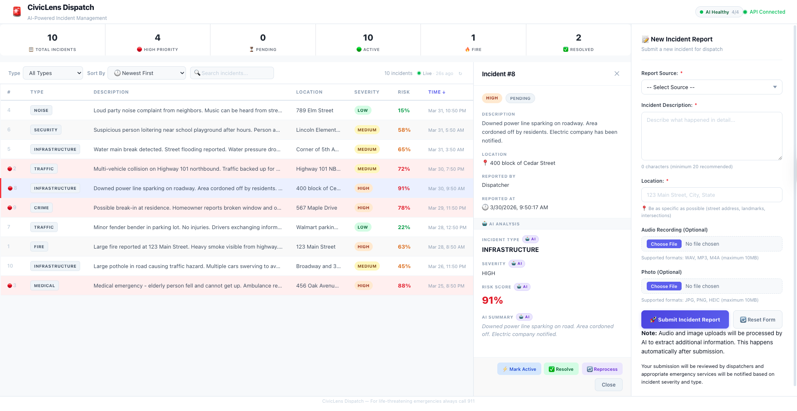

# CivicLens Dispatch

**Multimodal AI-powered emergency incident triage platform**

CivicLens Dispatch helps emergency dispatch centers automatically analyze, classify, and prioritize citizen incident reports using four AI models that process text, audio, and images in real time.

(docs/screenshots/dashboard.png)



## What It Does

A citizen submits an incident report (text description + optional audio recording + optional photo). The system automatically:

1. **Transcribes audio** using OpenAI Whisper speech-to-text
2. **Detects objects in photos** using Facebook DETR object detection
3. **Classifies the incident** type (fire, medical, traffic, crime, etc.) and severity (high/medium/low) using zero-shot NLP
4. **Generates a summary** of the full report using abstractive summarization
5. **Calculates a risk score** (0-100%) to help dispatchers prioritize

Dispatchers see all AI results in a real-time dashboard with search, filtering, and sorting.

## Tech Stack

### Backend
- **Python 3.13** — Primary language
- **FastAPI** — Async web framework with automatic API docs
- **SQLAlchemy** — Database ORM and query builder
- **SQLite** (dev) / **PostgreSQL** (prod) — Relational database
- **Pydantic** — Data validation and serialization

### Frontend
- **React 18** — Component-based UI framework
- **Vite** — Fast build tool and dev server
- **CSS** — Custom styling with responsive design

### AI Models (via Hugging Face Inference API)
| Model | Task | Modality |
|-------|------|----------|
| `openai/whisper-large-v3` | Speech-to-text transcription | Audio |
| `facebook/detr-resnet-50` | Object detection in images | Vision |
| `facebook/bart-large-mnli` | Incident classification + risk scoring | Text |
| `facebook/bart-large-cnn` | Abstractive summarization | Text |

### Infrastructure
- **asyncio.gather()** — Parallel AI processing (2x speedup)
- **Background tasks** — Non-blocking AI pipeline
- **Hugging Face Router API** — Serverless model inference

## Features

- **Full AI pipeline** — 4 models, 3 modalities (audio + text + images), zero stubs
- **Parallel processing** — Independent AI tasks run simultaneously
- **Real-time dashboard** — Auto-refreshing incident table with live data
- **AI health monitoring** — Status endpoint checks all model availability
- **Search & filter** — Full-text search across descriptions, transcripts, summaries
- **Incident reprocessing** — Re-run AI pipeline on any incident with one click
- **File uploads** — Audio recordings and photos with automatic AI analysis
- **Responsive design** — Works on desktop and mobile

## Quick Start

### Prerequisites
- Python 3.10+
- Node.js 18+
- Hugging Face account with API token ([get one here](https://huggingface.co/settings/tokens))

### Backend Setup

```bash
# Clone the repository
git clone https://github.com/Suhas-Bharthepude/civiclens-dispatch-.git
cd civiclens-dispatch-

# Create and activate virtual environment
python -m venv .venv
source .venv/bin/activate

# Install dependencies
cd backend
pip install -r requirements.txt

# Configure environment
cp .env.example .env
# Edit .env and add your HUGGINGFACE_API_KEY

# Start the server
uvicorn app.main:app --reload
```

Backend runs at: http://localhost:8000
API docs at: http://localhost:8000/docs

### Frontend Setup

```bash
# In a new terminal
cd frontend
npm install
npm run dev
```

Frontend runs at: http://localhost:5173

## API Endpoints

### Incidents
| Method | Endpoint | Description |
|--------|----------|-------------|
| `POST` | `/incidents` | Create new incident (triggers AI pipeline) |
| `GET` | `/incidents` | List all incidents (with search/filter) |
| `GET` | `/incidents/{id}` | Get single incident |
| `PATCH` | `/incidents/{id}` | Update incident |
| `DELETE` | `/incidents/{id}` | Delete incident |
| `POST` | `/incidents/{id}/audio` | Upload audio file |
| `POST` | `/incidents/{id}/image` | Upload image file |
| `POST` | `/incidents/{id}/reprocess` | Re-run AI pipeline |

### System
| Method | Endpoint | Description |
|--------|----------|-------------|
| `GET` | `/health` | Server health check |
| `GET` | `/ai/status` | AI pipeline health (all 4 models) |

## Project Structure

```
civiclens-dispatch-/
├── backend/
│   ├── app/
│   │   ├── main.py                 # FastAPI application entry point
│   │   ├── config.py               # Environment configuration
│   │   ├── db/
│   │   │   ├── database.py         # Database connection
│   │   │   └── models.py           # Table definitions
│   │   ├── routes/
│   │   │   ├── incidents.py        # Incident CRUD + file upload endpoints
│   │   │   └── ai_status.py        # AI health check endpoint
│   │   ├── schemas/
│   │   │   └── incident.py         # Pydantic validation models
│   │   ├── services/
│   │   │   ├── incident_processor.py  # AI pipeline orchestrator
│   │   │   ├── asr.py                # Whisper speech-to-text
│   │   │   ├── text_classifier.py    # Zero-shot classification
│   │   │   ├── summarizer.py         # BART-CNN summarization
│   │   │   ├── risk_scorer.py        # Zero-shot risk scoring
│   │   │   └── image_analyzer.py     # DETR object detection
│   │   └── utils/
│   │       └── file_utils.py       # File upload helpers
│   ├── scripts/
│   │   ├── seed_incidents.py       # Populate test data
│   │   ├── test_e2e.py            # End-to-end integration tests
│   │   └── test_*.py              # Individual service tests
│   └── tests/                      # Pytest test suite
├── frontend/
│   ├── src/
│   │   ├── App.jsx                 # Main application component
│   │   ├── api/client.js           # Centralized API client
│   │   ├── components/
│   │   │   ├── dashboard/          # Dashboard components
│   │   │   ├── forms/              # Incident submission form
│   │   │   ├── layout/             # Layout components
│   │   │   └── shared/             # Reusable components
│   │   └── hooks/                  # Custom React hooks
│   └── index.html
├── docs/                           # Documentation
└── notes/                          # Learning journal
```

## AI Pipeline Architecture

```
Citizen submits incident (description + audio + photo)
    │
    ├─ Phase 1 (parallel):
    │   ├─ Whisper ASR ──────── audio → transcript
    │   └─ DETR Detection ───── image → object labels
    │
    ├─ Phase 2 (parallel, uses Phase 1 results):
    │   ├─ BART-MNLI ────────── text → type + severity
    │   ├─ BART-CNN ─────────── text → summary
    │   └─ BART-MNLI ────────── text → risk score (0-100%)
    │
    └─ Results saved to database → Dispatcher sees in dashboard
```

Total pipeline time: ~20-45 seconds (parallel) vs ~60-120 seconds (sequential)

## Running Tests

```bash
# Backend unit tests
cd backend
pytest

# End-to-end integration test (server must be running)
PYTHONPATH=. python scripts/test_e2e.py

# Individual AI service tests
PYTHONPATH=. python scripts/test_risk_scorer.py
PYTHONPATH=. python scripts/test_classifier.py
PYTHONPATH=. python scripts/test_summarizer.py
PYTHONPATH=. python scripts/test_image_analyzer.py
PYTHONPATH=. python scripts/test_pipeline_timing.py
```

## Development Timeline

Built over 54 days as a learning project:

| Phase | Days | Focus |
|-------|------|-------|
| Foundation | 1-7 | Python, Git, FastAPI basics |
| Database | 8-14 | SQLAlchemy, CRUD operations |
| Backend Polish | 15-21 | Async processing, file uploads, testing |
| React Frontend | 22-30 | Components, state management, API integration |
| Audio Pipeline | 31-40 | Whisper ASR, transcription, upload UX |
| AI Models | 41-50 | Classification, risk scoring, summarization, image analysis |
| Polish | 51-54 | E2E testing, status monitoring, documentation |

## Author

**Suhas Bharthepude**
- GitHub: [@Suhas-Bharthepude](https://github.com/Suhas-Bharthepude)

## License

MIT License — see LICENSE file


